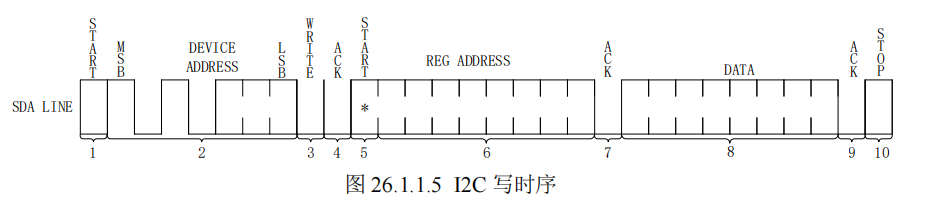
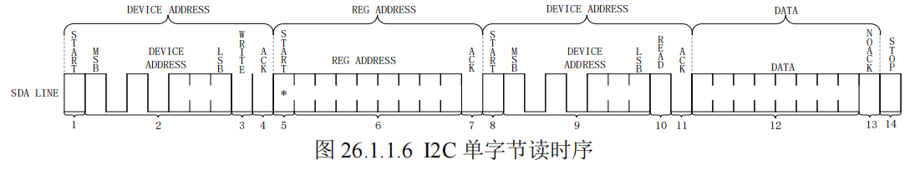
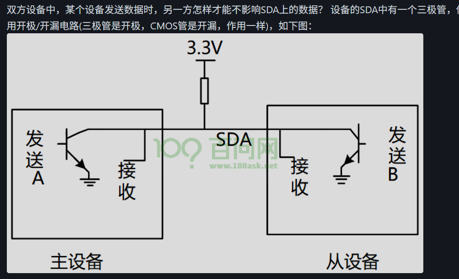
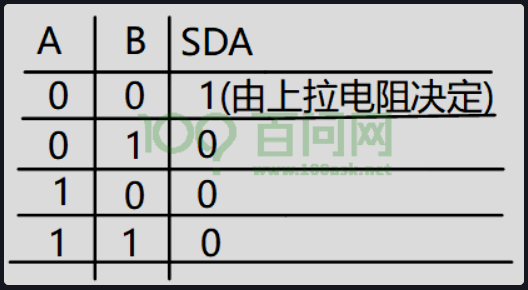

## I2C 外设

### 基础概念
**前提**
- I2C有两条线，一条`时钟线`（SCL），一条`数据线`（SDA）
- I2C的SCL交替出现高低电平的方波，由主机主动产生，从机同步跟随
- SDA同一时间只能由一个设备发送数据，所以是`半双工`
- SCL`高电平`期间数据线数据有效，低电平期间主机可以安全切换 SDA（数据线）的电平
- SCL高电平传输数据期间SDA不可以随便切换，否则可能被误判为起始位、停止位

**I2C起始位**：起始条件 (START) 是：SCL保持高电平时，SDA 由高电平拉低，出现`下降沿`
**I2C停止位**：停止条件 (STOP) 是：SCL保持高电平时，SDA 由低电平拉高，出现`上升沿`
**I2C数据位**：数据位是8位，在SCL高电平期间有效，SDA必须保持稳定，不能随意切换。
**I2C 应答信号**：当主机发送完8位数据以后会将SDA设置为`输入状态`，等待从机应答，也就是等到从机告诉主机它接收到数据了。应答信号是由从机发出的，主机需要提供应答信号所需的时钟，主机发送完 8 位数据以后紧跟着的一个时钟信号就是给应答信号使用的。从机通过
将SDA`拉低`来表示发出应答信号，表示通信成功，否则表示通信失败。

### I2C 写时序

图 26.1.1.5 就是 I2C 写时序(`单字节`)，我们来看一下写时序的具体步骤：
1)  开始信号。
2)  发送 I2C 设备地址，每个 I2C 器件都有一个设备地址，通过发送具体的设备地址来决定访问哪个 I2C 器件。这是一个 8 位的数据，`其中高 7 位是设备地址，最后 1 位是读写位`，为 1 的话表示这是一个读操作，为 0 的话表示这是一个写操作。
3)  I2C 器件地址后面跟着一个读写位，为 0 表示写操作，为 1 表示读操作。
4)  从机发送的 ACK 应答信号。
5)  重新发送开始信号。
6)  发送要写入数据的寄存器地址。
7)  从机发送的 ACK 应答信号。
8)  发送要写入寄存器的数据。
9)  从机发送的 ACK 应答信号。
10) 停止信号。

### I2C 读时序

图 26.1.1.6 就是 I2C 读时序

I2C 单字节读时序比写时序要复杂一点，读时序分为 4 大步，第一步是发送设备地址，第二步是发送要读取的寄存器地址，第三步重新发送设备地址，最后一步就是 I2C 从器件输出要读取的寄存器值，我们具体来看一下这几步。

1) 主机发送起始信号。
2) 主机发送要读取的 I2C 从`设备地址`。
3) 读写控制位，因为是向 I2C 从设备发送数据，因此是`写信号`,而不是读信号,表示要写入寄存器地址
4) 从机发送的 ACK 应答信号。
5) 重新发送 START 信号。
6) 主机发送要读取的`寄存器地址`。
7) 从机发送的 ACK 应答信号。
8) 重新发送 START 信号。
9) `重新发送`要读取的 I2C 从`设备地址`。
10) 读写控制位，这里是`读信号`，表示接下来是从 I2C 从设备里面`读取数据 `。
11) 从机发送的 ACK 应答信号。
12) 从 I2C 器件里面读取到的数据。
13) 主机发出 NO ACK 信号，表示读取完成，`不需要从机再发送 ACK 信号了`
14) 主机发出 STOP 信号，停止 I2C 通信。

### 传输稳定性
- 当某一方开始传输数据时，另一方应该怎么做才能不影响SDA上的数据？

- 我们可以在双方各接一个三极管 如图

- 这样任意一方输出高电平时，三极管导通，SDA接地，输出低电平，两方都输出低电平时，上拉电阻让SDA高电平，确保数据线稳定。

- 当某一个芯片不想影响SDA线时，那就不驱动这个三极管（不输出高电平）

- 想让SDA输出高电平，双方都不驱动三极管(SDA通过上拉电阻变为高电平)

- 想让SDA输出低电平，就驱动三极管（输出高电平）
