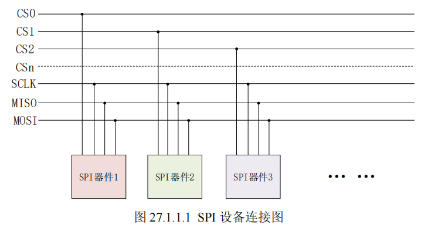
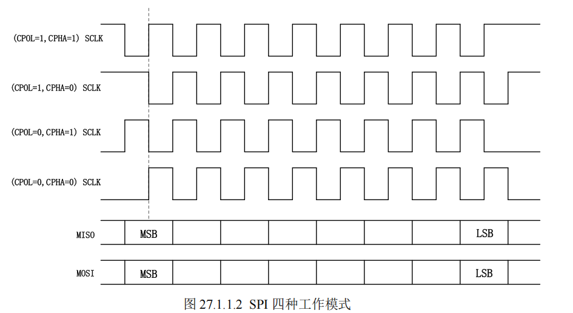
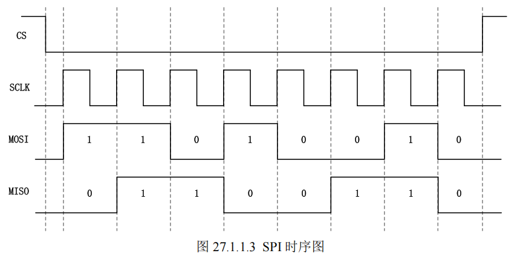

# SPI 串行通信接口

SPI 全称是 **Serial Peripheral Interface**，也就是串行外围设备接口。SPI 是 Motorola 公司推出的一种同步串行接口技术，是一种**高速、全双工**的同步通信总线，SPI 时钟频率相比 I2C 要高很多，最高可以工作在上百MHz。

SPI 以**主从方式**工作，通常是有一个主设备和一个或多个从设备，一般 SPI 需要 4 根线，但是也可以使用三根线（单向传输），本章我们讲解标准的 4 线 SPI，这四根线如下：

1. **CS/SS，Slave Select / Chip Select**
    片选信号线，用于选择需要进行通信的从设备。I2C 主机是通过发送从机设备地址来选择需要进行通信的从机设备的，SPI 主机不需要发送从机地址，直接将相应的从机设备片选信号`拉低`即可。

2. **SCK，Serial Clock**
    串行时钟，和 I2C 的 SCL 一样，为 SPI 通信提供时钟。

3. **MOSI/SDO，Master Out Slave In / Serial Data Output**
    简称主出从入信号线，这根数据线只能用于**主机向从机发送数据**，也就是主机输出，从机输入。

4. **MISO/SDI，Master In Slave Out / Serial Data Input**
    简称主入从出信号线，这根数据线只能用于**从机向主机发送数据**，也就是主机输入，从机输出。

SPI 通信都是由**主机发起**的，主机需要提供通信的时钟信号。主机通过 SPI 线连接多个从设备的结构如图所示：
SCLK、MOSI、MISO 为共享总线，每个从设备各自独立占用一根 CS 片选线。

---

## SPI 四种工作模式
SPI 有四种工作模式，通过**串行时钟极性(CPOL)**和**相位(CPHA)**的搭配来得到四种工作模式：

1. **CPOL=0**：串行时钟空闲状态为低电平。
2. **CPOL=1**：串行时钟空闲状态为高电平。
3. **CPHA=0**：串行时钟的第一个跳变沿（上升沿或下降沿）采集数据。
4. **CPHA=1**：串行时钟的第二个跳变沿（上升沿或下降沿）采集数据。

这四种工作模式组合为：
- CPOL=0，CPHA=0
- CPOL=0，CPHA=1
- CPOL=1，CPHA=0
- CPOL=1，CPHA=1

---

## SPI 通信时序
跟 I2C 一样，SPI 也是有时序图的。以 **CPOL=0，CPHA=0** 这个工作模式为例，SPI 进行全双工通信的时序如下：

1. 主机先将 **CS 片选信号拉低**，选中要通信的从设备。
2. 主机提供 SCK 时钟，在时钟边沿控制下进行数据传输。
3. **MOSI** 与 **MISO** 同时进行数据移位：
   - 主机通过 MOSI 向从机发数据
   - 从机通过 MISO 向主机回传数据

|参数|定义|
|---|---|
|CPOL=0|SCLK 空闲电平为 低电平（0），CS 拉低后 SCLK 从低开始跳变|
|CPHA=0|数据在 SCLK 的第一个上升沿（前沿）采样，在 SCLK 的下降沿（后沿）更新|
|数据位宽|本次传输为 8 位数据（SCLK 共 8 个完整周期）|
|传输方向|高位在前（MSB First）（SPI 默认标准）|

从时序图可以看出，SPI 的时序图很简单，不像 I2C 那样还要分为读时序和写时序，因为 SPI 是**全双工**的，所以读写时序可以一起完成。

例如图中：
- MOSI 数据线发出了 `11010010` 这个数据给从设备
- 同时从设备也通过 MISO 线给主设备返回了 `01100110` 这个数据

