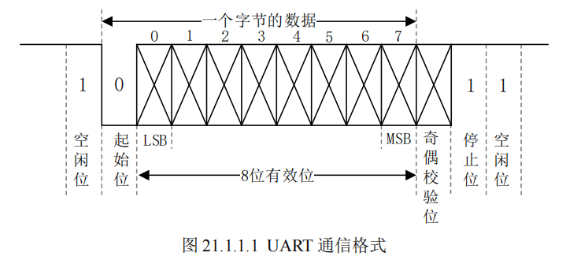

## UART 外设

### 基础概念
**前提**
- UART 有三条线：`TX`（发送）、`RX`（接收）、`GND`（参考地）
- TX 和 RX 相互独立，可同时收发，因此是**全双工**通信
- UART 是**异步通信**，没有时钟线，依靠双方约定好的波特率同步
- 通信双方必须共 GND，否则电平无统一参考，数据无法正确识别

**UART 帧结构**：一帧数据由**起始位 + 数据位 + 校验位（可选）+ 停止位**组成
- **起始位**：1 位，表示数据开始传输，发送0也就是拉低 TX 表示一帧数据开始
- **数据位**：可选5-8位，通常8位(一字节)，从低位到高位依次传输
- **奇偶校验位**：可选，用于简单检错（奇校验、偶校验），检查数据中“1”的位数是奇数还是偶数
- **停止位**：1 位1.5位或者2位，拉高 TX 表示一帧数据结束

**波特率**：每秒传输的二进制位数，是双方同步的关键，常见 9600、115200 等。
**电平有效规则**：UART 以高低电平直接表示数据，空闲状态时 TX、RX 默认为高电平。

### 接口电平
- UART 电平有TTL、RS232、RS485、RS422 四种电平
1. **TTL 电平**
   - 3.3V 或 5V
   - 高：>2V（3.3V系统）或 >2.4V（5V系统）
   - 低：<0.8V
   - 用于**芯片内部、板间近距离通信**

2. **RS232 电平**
   - ±3V～±15V
   - 高：负电压
   - 低：正电压
   - 与 TTL 反相，距离更远，抗干扰更强
   - 用于**串口调试口、RS232 转 USB**

3. **RS485 电平**
   - 差分信号 A、B 线
   - 抗干扰极强，传输距离远
   - 半双工，多用于**工业多机通信**

4. **RS422 电平**
   - 差分信号，全双工
   - 距离远、抗干扰强
   - 工业远距离点对点通信

### UART 发送时序
1) 总线空闲，TX 保持**高电平**。
2) 拉低 TX，产生**1 位起始位**，通知接收方准备接收。
3) 依次发送 8 位数据位（低位在前，高位在后）。
4) 可选择发送 1 位校验位，用于数据校验。
5) 拉高 TX，发送**1 位或多位停止位**，表示一帧数据发送完成。
6) 发送完成后 TX 回到高电平空闲状态。

### UART 接收时序
1) 检测到 RX 从高电平变为低电平，识别为**起始位**，开始接收。
2) 根据波特率在每位数据中间位置采样 RX 电平，依次读取 8 位数据。
3) 若配置了校验位，则读取并验证校验位是否正确。
4) 检测到停止位（高电平），表示一帧数据接收完成。
5) 将接收到的数据存入缓存，等待 CPU 读取。

### 应用场景
问：“UART 有什么特点，主要用在什么地方？”
答：UART 是异步全双工通信，接线简单、使用方便，多用于**调试打印、串口模块、蓝牙/WiFi 模块通信、GPS、模组 AT 指令交互**等场景。
优点：协议简单、全双工、使用方便；缺点：无时钟同步、抗干扰一般、传输距离有限、只能点对点通信。